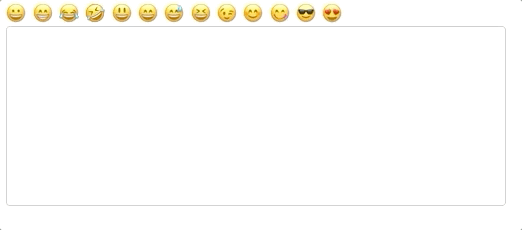
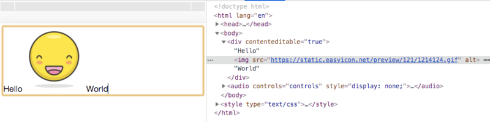
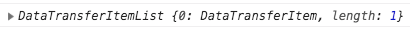
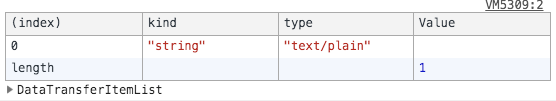

# Web聊天工具的富文本输入框

最近折腾 Websocket，打算开发一个聊天室应用练练手。在应用开发的过程中发现可以插入 emoji ，粘贴图片的富文本输入框其实蕴含着许多有趣的知识，于是便打算记录下来和大家分享。

仓库地址：[chat-input-box](https://github.com/jrainlau/chat-input-box)
预览地址：https://codepen.io/jrainlau/pen/wOMOYw

首先来看看 demo 效果：



是不是觉得很神奇？接下来我会一步步讲解这里面的功能都是如何实现的。

## 输入框富文本化
传统的输入框都是使用 `<textarea>` 来制作的，它的优势是非常简单，但最大的缺陷却是无法展示图片。为了能够让输入框能够展示图片（富文本化），我们可以采用设置了 `contenteditable="true"` 属性的 `<div>` 来实现这里面的功能。

简单创建一个 `index.html` 文件，然后写入如下内容：
```html
<div class="editor" contenteditable="true">
  
</div>
```
打开浏览器，就能看到一个默认已经带了一张图片的输入框：





光标可以在图片前后移动，同时也可以输入内容，甚至通过退格键删除这张图片——换句话说，图片也是可编辑内容的一部分，也意味着输入框的富文本化已经体现出来了。

接下来的任务，就是思考如何直接通过 `control + v` 把图片粘贴进去了。

## 处理粘贴事件
任何通过“复制”或者 `control + c` 所复制的内容（包括屏幕截图）都会储存在剪贴板，在粘贴的时候可以在输入框的 `onpaste` 事件里面监听到。

```javascript
document.querySelector('.editor').addEventListener('paste', (e) => {
	console.log(e.clipboardData.items)
})
```

而剪贴板的的内容则存放在 `DataTransferItemList` 对象中，可以通过 `e.clipboardData.items` 访问到：



细心的读者会发现，如果直接在控制台点开 `DataTransferItemList` 前的小箭头，会发现对象的 `length` 属性为0。说好的剪贴板内容呢？其实这是 Chrome 调试的一个小坑。在开发者工具里面，`console.log` 出来的对象是一个引用，会随着原始数据的改变而改变。由于剪贴板的数据已经被“粘贴”进输入框了，所以展开小箭头以后看到的 `DataTransferItemList` 就变成空的了。为此，我们可以改用 `console.table` 来展示实时的结果。




在明白了剪贴板数据的存放位置以后，就可以编写代码来处理它们了。由于我们的富文本输入框比较简单，所以只需要处理两类数据即可，其一是普通的文本类型数据，包括 emoji 表情；其二则是图片类型数据。

新建 `paste.js` 文件：

```javascript
const onPaste = (e) => {
  // 如果剪贴板没有数据则直接返回
  if (!(e.clipboardData && e.clipboardData.items)) {
    return
  }
  // 用Promise封装便于将来使用
  return new Promise((resolve, reject) => {
    // 复制的内容在剪贴板里位置不确定，所以通过遍历来保证数据准确
    for (let i = 0, len = e.clipboardData.items.length; i < len; i++) {
      const item = e.clipboardData.items[i]
      // 文本格式内容处理
      if (item.kind === 'string') {
        item.getAsString((str) => {
          resolve(str)
        })
      // 图片格式内容处理
      } else if (item.kind === 'file') {
        const pasteFile = item.getAsFile()
        // 处理pasteFile
        // TODO(pasteFile)
      } else {
        reject(new Error('Not allow to paste this type!'))
      }
    }
  })
}

export default onPaste
```

然后就可以在 `onPaste` 事件里面直接使用了：

```javascript
document.querySelector('.editor').addEventListener('paste', async (e) => {
	const result = await onPaste(e)
    console.log(result)
})
```

上面的代码支持文本格式，接下来就要对图片格式进行处理了。玩过 `<input type="file">` 的同学会知道，包括图片在内的所有文件格式内容都会储存在 `File` 对象里面，这在剪贴板里面也是一样的。于是我们可以编写一套通用的函数，专门来读取 `File` 对象里的图片内容，并把它转化成 `base64` 字符串。

## 粘贴图片
为了更好地在输入框里展示图片，必须限制图片的大小，所以这个图片处理函数不仅能够读取 `File` 对象里面的图片，还能够对其进行压缩。

新建一个 `chooseImg.js` 文件：

```javascript
/**
 * 预览函数
 *
 * @param {*} dataUrl base64字符串
 * @param {*} cb 回调函数
 */
function toPreviewer (dataUrl, cb) {
  cb && cb(dataUrl)
}

/**
 * 图片压缩函数
 *
 * @param {*} img 图片对象
 * @param {*} fileType  图片类型
 * @param {*} maxWidth 图片最大宽度
 * @returns base64字符串
 */
function compress (img, fileType, maxWidth) {
  let canvas = document.createElement('canvas')
  let ctx = canvas.getContext('2d')

  const proportion = img.width / img.height
  const width = maxWidth
  const height = maxWidth / proportion

  canvas.width = width
  canvas.height = height

  ctx.fillStyle = '#fff'
  ctx.fillRect(0, 0, canvas.width, canvas.height)
  ctx.drawImage(img, 0, 0, width, height)

  const base64data = canvas.toDataURL(fileType, 0.75)
  canvas = ctx = null

  return base64data
}

/**
 * 选择图片函数
 *
 * @param {*} e input.onchange事件对象
 * @param {*} cb 回调函数
 * @param {number} [maxsize=200 * 1024] 图片最大体积
 */
function chooseImg (e, cb, maxsize = 200 * 1024) {
  const file = e.target.files[0]

  if (!file || !/\/(?:jpeg|jpg|png)/i.test(file.type)) {
    return
  }

  const reader = new FileReader()
  reader.onload = function () {
    const result = this.result
    let img = new Image()

    if (result.length <= maxsize) {
      toPreviewer(result, cb)
      return
    }

    img.onload = function () {
      const compressedDataUrl = compress(img, file.type, maxsize / 1024)
      toPreviewer(compressedDataUrl, cb)
      img = null
    }

    img.src = result
  }

  reader.readAsDataURL(file)
}

export default chooseImg

```

> 关于使用 `canvas` 压缩图片和使用 `FileReader` 读取文件的内容在这里就不赘述了，感兴趣的读者可以自行查阅。

回到上一步的 `paste.js` 函数，把其中的 `TODO()` 改写成 `chooseImg()` 即可：

```javascript
const imgEvent = {
  target: {
    files: [pasteFile]
  }
}
chooseImg(imgEvent, (url) => {
  resolve(url)
})
```

回到浏览器，如果我们复制一张图片并在输入框中执行粘贴的动作，将可以在控制台看到打印出了以 `data:image/png;base64` 开头的图片地址。

## 输入框中插入内容
经过前面两个步骤，我们后已经可以读取剪贴板中的文本内容和图片内容了，接下来就是把它们正确的插入输入框的光标位置当中。

对于插入内容，我们可以直接通过 `document.execCommand` 方法进行。关于这个方法详细用法可以在[MDN文档](https://developer.mozilla.org/en-US/docs/Web/API/Document/execCommand)里面找到，在这里我们只需要使用 `insertText` 和 `insertImage` 即可。

```javascript
document.querySelector('.editor').addEventListener('paste', async (e) => {
	const result = await onPaste(e)
    const imgRegx = /^data:image\/png;base64,/
    const command = imgRegx.test(result) ? 'insertImage': 'insertText'
    
    document.execCommand(command, false, result)
})
```

但是在某些版本的 Chrome 浏览器下，`insertImage` 方法可能会失效，这时候便可以采用另外一种方法，利用 `Selection` 来实现。而之后选择并插入 emoji 的操作也会用到它，因此不妨先来了解一下。

当我们在代码中调用 `window.getSelection()` 后会获得一个 `Selection` 对象。如果在页面中选中一些文字，然后在控制台执行 `window.getSelection().toString()`，就会看到输出是你所选择的那部分文字。

与这部分区域文字相对应的，是一个 `range` 对象，使用 `window.getSelection().getRangeAt(0)` 即可以访问它。`range` 不仅包含了选中区域文字的内容，还包括了区域的起点位置 `startOffset` 和终点位置 `endOffset`。

我们也可以通过 `document.createRange()` 的办法手动创建一个 `range`，往它里面写入内容并展示在输入框中。

对于插入图片来说，要先从 `window.getSelection()` 获取` range` ，然后往里面插入图片。

```javascript
document.querySelector('.editor').addEventListener('paste', async (e) => {
  // 读取剪贴板的内容
  const result = await onPaste(e)
  const imgRegx = /^data:image\/png;base64,/
  // 如果是图片格式（base64），则通过构造range的办法把标签插入正确的位置
  // 如果是文本格式，则通过document.execCommand('insertText')方法把文本插入
  if (imgRegx.test(result)) {
    const sel = window.getSelection()
    if (sel && sel.rangeCount === 1 && sel.isCollapsed) {
      const range = sel.getRangeAt(0)
      const img = new Image()
      img.src = result
      range.insertNode(img)
      range.collapse(false)
      sel.removeAllRanges()
      sel.addRange(range)
    }
  } else {
    document.execCommand('insertText', false, result)
  }
})
```

这种办法也能很好地完成粘贴图片的功能，并且通用性会更好。接下来我们还会利用 `Selection`，来完成 emoji 的插入。

## 插入 emoji
不管是粘贴文本也好，还是图片也好，我们的输入框始终是处于聚焦（focus）状态。而当我们从表情面板里选择 emoji 表情的时候，输入框会先失焦(blur），然后再重新聚焦。由于 `document.execCommand` 方法必须在输入框聚焦状态下才能触发，所以对于处理 emoji 插入来说就无法使用了。

上一小节讲过，`Selection` 可以让我们拿到聚焦状态下所选文本的起点位置 `startOffset` 和终点位置 `endOffset`，如果没有选择文本而仅仅处于聚焦状态，那么这两个位置的值相等（相当于选择文本为空），也就是光标的位置。只要我们能够在失焦前记录下这个位置，那么就能够通过 `range` 把 emoji 插入正确的地方了。

首先编写两个工具方法。新建一个 `cursorPosition.js` 文件：

```javascript

/**
 * 获取光标位置
 * @param {DOMElement} element 输入框的dom节点
 * @return {Number} 光标位置
 */
export const getCursorPosition = (element) => {
  let caretOffset = 0
  const doc = element.ownerDocument || element.document
  const win = doc.defaultView || doc.parentWindow
  const sel = win.getSelection()
  if (sel.rangeCount > 0) {
    const range = win.getSelection().getRangeAt(0)
    const preCaretRange = range.cloneRange()
    preCaretRange.selectNodeContents(element)
    preCaretRange.setEnd(range.endContainer, range.endOffset)
    caretOffset = preCaretRange.toString().length
  }
  return caretOffset
}

/**
 * 设置光标位置
 * @param {DOMElement} element 输入框的dom节点
 * @param {Number} cursorPosition 光标位置的值
 */
export const setCursorPosition = (element, cursorPosition) => {
  const range = document.createRange()
  range.setStart(element.firstChild, cursorPosition)
  range.setEnd(element.firstChild, cursorPosition)
  const sel = window.getSelection()
  sel.removeAllRanges()
  sel.addRange(range)
}

```

有了这两个方法以后，就可以放入 editor 节点里面使用了。首先在节点的 `keyup` 和 `click` 事件里记录光标位置：

```javascript
let cursorPosition = 0
const editor = document.querySelector('.editor')
editor.addEventListener('click', async (e) => {
  cursorPosition = getCursorPosition(editor)
})
editor.addEventListener('keyup', async (e) => {
  cursorPosition = getCursorPosition(editor)
})
```

记录下光标位置后，便可通过调用 `insertEmoji()` 方法插入 emoji 字符了。

```javascript
insertEmoji (emoji) {
  const text = editor.innerHTML
  // 插入 emoji
  editor.innerHTML = text.slice(0, cursorPosition) + emoji + text.slice(cursorPosition, text.length)
  // 光标位置后挪一位，以保证在刚插入的 emoji 后面
  setCursorPosition(editor, this.cursorPosition + 1)
  // 更新本地保存的光标位置变量（注意 emoji 占两个字节大小，所以要加1）
  cursorPosition = getCursorPosition(editor) + 1 //  emoji 占两位
}
```

## 尾声
文章涉及的代码已经上传到[仓库](https://github.com/jrainlau/chat-input-box)，为了简便起见采用 `VueJS` 处理了一下，不影响阅读。最后想说的是，这个 Demo 仅仅完成了输入框最基础的部分，关于复制粘贴还有很多细节要处理（比如把别处的行内样式也复制了进来等等），在这里就不一一展开了，感兴趣的读者可以自行研究，更欢迎和我留言交流~
